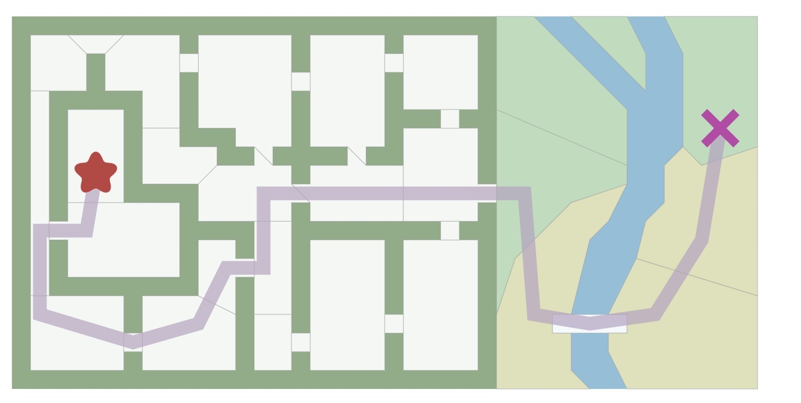

# A\* 搜索算法<br>

`A*`是一种流行的寻路算法,它是以广度优选搜索为基础的算法(Breadth First Search)



##1. 算法总览

- Breadth First Search: 对所有的方向视为同等的重要
- Dijkstra’s Algorithm: 优化最短路径，当在地图中的每一步的代价不同时，使用Dijkstra代替BFS算法
- A\* : 是一种修改版本的Dijkstra's算法，它向着目的的方向优化，Dijkstra可以寻找所有的方向，而A\*算法寻找一个方向-接近目标的方向

##2. Breadth First Search

广度的优先搜索，其对于一个中心点，去遍历和它相邻的点，依次进行访问，为了防止在查找邻近点时重复，因此需要一个变量表示其是否被访问到。核心的代码仅仅10行，如下所示：

```
frontier = Queue()  //用队列保存访问节点
frontier.put(start)
visited = {}
visited[start] = True // 是否访问

while not frontier.empty():
   current = frontier.get()
   for next in graph.neighbors(current): //访问邻近节点
      if next not in visited:
         frontier.put(next)
         visited[next] = True
```
###2.1 一个BFS典型问题
-   [Flood Fill](https://leetcode.com/problems/flood-fill/)<br>
完全套用上面的模板即可,代码如下:

```
import Queue
class Solution(object):
    def floodFill(self, image, sr, sc, newColor):
        if not image:
            return image
        oldColor = image[sr][sc]
        if oldColor == newColor:
            return image

        rows, cols = len(image), len(image[0])
        dir = [[0, -1], [1, 0], [0, 1], [-1, 0]] 
        queue = Queue.Queue()
        queue.put([sr, sc])
        visit = {}
        visit[str(sr) + ',' + str(sc)] = True   # 标记是否访问
        while not queue.empty():
            sr, sc = queue.get()
            image[sr][sc] = newColor
            for dx, dy in dir: # 找相邻的位置
                x, y = sr + dx, sc + dy
                if x >= 0 and x < rows and y >=0 and y < cols and not visit.has_key(str(x) + ',' + str(y)) and image[x][y] == oldColor:
                    queue.put([x, y])
                    visit[str(x) + ',' + str(y)] = True
        return image
```

###2.2 查找最短路径

BFS的一大优点，就是其遍历的顺序有最短，最小等信息，如求最短路径等问题，这些是不能通过DFS去完成的，因为其失去了位置的信息<br>
上述的BFS没有构建路径，其仅有visit去标记是否遍历，可以记录next是从哪里过来的，即可回溯构建路径,同时可以设置提前停止，即遍历到目标goal,提前结束程序:
```
frontier = Queue()
frontier.put(start )
came_from = {}
came_from[start] = None

while not frontier.empty():
   current = frontier.get()

   if current == goal:  # 如果到达目的，提前结束
      break

   for next in graph.neighbors(current):
      if next not in came_from:
         frontier.put(next)
         came_from[next] = current
```
**回溯得到start->goal的路径**
```
current = goal
path = []
while current != start:
   path.append(current)
   current = came_from[current]
path.append(start) # optional
path.reverse() # optional
```
**例题**
- [ Perfect Squares](https://leetcode.com/problems/perfect-squares/)
因为求最少的组合个数，因此可以想到BFS,两个数相差平方数，则认为其有一条边，因此使用一个数组去记录到达此数的最短路径,代码如下所示：

```
class Solution {
public:
    int numSquares(int n) {
        vector<int> f(n + 1, n); //记录到达当前位置的最短路径
        queue<int> q;
        f[0] = 0;
        q.push(0);
        while (!q.empty()) {
            int s = q.front();
            if (s == n)  //提前终止
                break;
            q.pop();
            for (int i = 1; s + i * i <= n; i++)  // 添加相邻节点
                if (f[s + i * i] > f[s] + 1) {    // 满足条件更新值
                    f[s + i * i] = f[s] + 1;
                    q.push(s + i * i);
                }
        }
        return f[n];
    }
};

```
思考：如果求其路径呢？<br>
很简单，保存当前最短路径的上一个状态，然后回溯即可

## 3. Dijkstra’s Algorithm 


## 4. Heuristic search

## 5. A\* Algorithm


